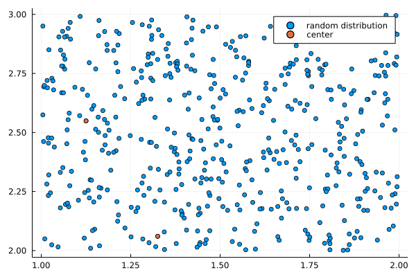

# Clustering Strategies
For the algorithms defined in this pakage the given set of points have to be sorted in an algebraic tree. 
Therefor the following strategys can be used. 

## Box Tree 
## K-Means Clustering Tree
#### Definition
The K-Means algorithm is a clustering strategy for n-dimensional spaces, in which each cluster is representet by its center. In this case the algortihm is implemented for a two or three dimensional euklidian space.
#### Idea
The goal of the algorithm is to divide the dataset in k clusters, which are alternately divided in k clusters. 
The procedur is as follows: At first there are k points choosen from the dataset as centers. Then each point is sorted to its closest center. For each resulting cluster the center is recalculated with its points and all points are resorted to the new centers. This step is repeatet for a givn number of iterations. The whole process is alternately repeated for each cluster.  
#### Algorithm
Givn is a random distrebution of datapoints in 2D, which should be sorted in an binary tree. 
Two points out of the dataset are choosen as the first centers. For each of the points the euklidiean distance to both centers is calculated by:

```math
    dist = norm(x - c_i)\quad for\enspace i = 1,2,..,k
```
With $x$ the location of the datapoint and $c_i$ the centers. The point is then added to the colser center.




The centers are schown in the first picture in orange and each cluster is representet in the second picture by one color.
To achieve a more even distributen between both clusters, the centers are recalculated. Therefor the distance between the center and each point of the cluster has to be minimized.
This can be done by taking the mean over all points.

```math
    c_i = N_k^{-1} * \sum_{n=1}^{N_k} x_n
```
The dataset is resortet to the updated centers, resulting in the following distribution.


As it can be seen the updated clusters can result in a more even distribution. These steps can then be repeted for a givn amount of iterations. 
The final clusteres are afterwards taken as new distributions of datapoints and the algorithm can alternately be repeted until clusters with a minimum amount of points or a givn number of total clusters is reached. 

#### Comments
As it can be seen in the example more iterations will in general lead to more equal sized clusters. For non homogenous distributions equal sized clusters can not always be reached, but more iterations will generate in general a better tree structure for the algorithms in this package.
For the the algorithms in this package iterations between 10-100 and two children for each level are recomended.
